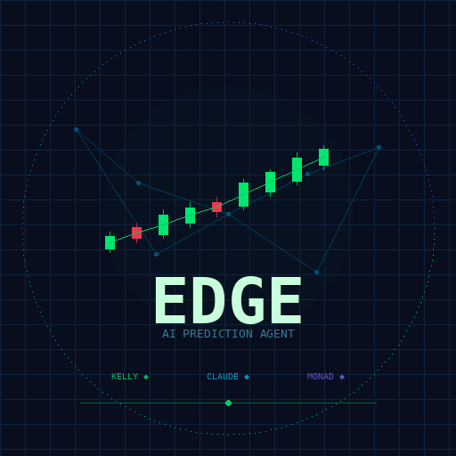

# EDGE — Autonomous AI Prediction Market Agent

<p align="center">
  
</p>

EDGE is a fully autonomous AI agent that trades prediction markets on **Polymarket** and **Kalshi** for real profit. It scans hundreds of markets, enriches them with live data, uses Claude AI to estimate fair probabilities, sizes positions with the Kelly Criterion, and executes real trades — all without human intervention.

The **$EDGE token** on [nad.fun](https://nad.fun) (Monad) is the agent's on-chain heartbeat. When profitable, the agent buys $EDGE. When losing, it sells. The token price is a live, trustless signal of agent performance.

**Hold $EDGE = bet on the agent's edge.**

---

## Architecture

```
┌──────────────────────────────────────────────────────────────┐
│                     EDGE AGENT LOOP                          │
│                    (runs every 10 min)                        │
│                                                              │
│  1. SCAN       Fetch 500+ markets from Polymarket & Kalshi   │
│  2. ENRICH     Pull live data (crypto, sports, weather)      │
│  3. ANALYZE    Claude AI estimates fair probability           │
│  4. SIZE       Kelly Criterion calculates optimal bet         │
│  5. EXECUTE    Place real trades via exchange APIs             │
│  6. SETTLE     Monitor outcomes, record P&L                   │
│  7. TOKEN      Buy/sell $EDGE based on performance            │
│  8. LEARN      Feed outcomes back to improve future bets      │
└──────────────────────────────────────────────────────────────┘
```

### Pipeline Detail

| Module | File | Role |
|--------|------|------|
| Scanner | `scanner.py`, `kalshi_scanner.py` | Fetches active markets from Polymarket (Gamma API) and Kalshi |
| Enricher | `enricher.py`, `sources/` | Routes markets to domain-specific data sources |
| Crypto Source | `sources/crypto.py` | CoinGecko prices, Fear & Greed Index, BTC on-chain metrics |
| Sports Source | `sources/sports.py` | ESPN injuries, scores, standings, news |
| Weather Source | `sources/weather.py` | NOAA forecasts, alerts, hurricane outlook |
| Pre-Analyzer | `pre_analyzer.py` | Mathematical fair values for crypto target markets (log-normal) |
| Analyst | `analyst.py` | Claude AI probability estimation with enriched data |
| Selector | `selector.py` | Picks which markets to trade (Claude + algorithmic) |
| Sizer | `sizer.py` | Kelly Criterion position sizing (half-Kelly for safety) |
| Executor | `executor.py` | Polymarket CLOB order execution |
| Kalshi Executor | `kalshi_executor.py` | Kalshi order execution with RSA-PSS auth |
| Accountant | `accountant.py` | Balance tracking, P&L ledger |
| Settlement | `settlement.py` | Monitors market outcomes |
| Position Monitor | `position_monitor.py` | Exit management (take profit, stop loss, edge decay) |
| Logger | `logger.py` | CSV trade logging |
| Token Trader | `monad/token_trader.py` | Buys/sells $EDGE token based on agent P&L |

---

## Quick Start

### 1. Clone & Install

```bash
git clone https://github.com/YOUR_USERNAME/edge-agent.git
cd edge-agent
pip install -r requirements.txt
```

### 2. Configure

```bash
cp .env.example .env
# Edit .env with your keys (see Configuration below)
```

### 3. Run (Dry Run)

```bash
python agent.py
# Agent runs in DRY_RUN=true mode by default (paper trading)
```

### 4. Go Live

```bash
# In .env, set:
DRY_RUN=false
python agent.py
```

---

## Configuration

Copy `.env.example` to `.env` and fill in your values:

### Required

| Variable | Description |
|----------|-------------|
| `ANTHROPIC_API_KEY` | Your Anthropic API key for Claude |

### Polymarket (optional)

| Variable | Description |
|----------|-------------|
| `PRIVATE_KEY` | Polygon wallet private key |
| `WALLET_ADDRESS` | Polygon wallet address |
| `POLYMARKET_SIGNATURE_TYPE` | `0` for EOA, `1` for proxy wallet |
| `POLYMARKET_FUNDER_ADDRESS` | Proxy wallet address (if using email signup) |
| `POLYMARKET_MODE` | `disabled`, `buy_only` (default), or `full` |

### Kalshi (optional)

| Variable | Description |
|----------|-------------|
| `KALSHI_API_KEY_ID` | From kalshi.com → Settings → API |
| `KALSHI_PRIVATE_KEY_PATH` | Path to RSA private key file (`.pem`) |
| `KALSHI_ORDER_TYPE` | `market` (instant fill) or `limit` (resting) |

### Monad / $EDGE Token (optional)

| Variable | Description |
|----------|-------------|
| `MONAD_PRIVATE_KEY` | Monad wallet private key |
| `MONAD_NETWORK` | `mainnet` or `testnet` |

After deploying the token on nad.fun, create `monad/token_config.json`:

```json
{
  "token_address": "0xYOUR_DEPLOYED_TOKEN",
  "token_symbol": "EDGE",
  "bonding_curve_router": "0x6F6B8F1a20703309951a5127c45B49b1CD981A22",
  "chain_id": 143,
  "rpc_url": "https://monad-mainnet.drpc.org",
  "network": "mainnet"
}
```

### Agent Tuning

| Variable | Default | Description |
|----------|---------|-------------|
| `DRY_RUN` | `true` | Paper trading mode |
| `MAX_BANKROLL_PCT` | `0.10` | Max 10% of bankroll per trade |
| `MIN_EDGE_PCT` | `0.01` | Minimum 1% edge to trade |
| `SCAN_INTERVAL_SECONDS` | `600` | 10 min between cycles |
| `TRADES_PER_CYCLE` | `5` | Max new trades per cycle |

---

## How the $EDGE Token Works

The agent treats $EDGE as a "fund share" reflecting its performance:

| Agent State | Token Action | Effect |
|---|---|---|
| P&L up >$0.50 | Buys $EDGE with 0.05 MON | Token price rises |
| P&L down >$0.50 | Sells 10% of EDGE holdings | Token price falls |
| Idle / cooldown | No action | Price unchanged |

This creates a live, on-chain performance indicator:
- **Token price up** → agent is profitable
- **Token price down** → agent is struggling
- **Anyone can buy/sell** alongside the agent on nad.fun's bonding curve

---

## Risk Management

- **Kelly Criterion**: Every bet is mathematically sized — no guessing
- **Half-Kelly**: Uses 50% of theoretical optimal for safety margin
- **Max 10% bankroll** per position (configurable)
- **$1 minimum** trade size — no dust bets
- **Position Monitor**: Auto-exits on take profit (30%), stop loss (50%), or edge decay
- **Analysis Cache**: Skips recently-analyzed markets to save API costs
- **Survival Mode**: If the agent goes broke, it stops. No bailouts.

---

## Project Structure

```
edge-agent/
├── agent.py                # Main loop: scan → analyze → trade → learn
├── analyst.py              # Claude AI fair value estimation
├── scanner.py              # Polymarket market scanner
├── kalshi_scanner.py       # Kalshi market scanner
├── enricher.py             # Domain data routing
├── sources/
│   ├── crypto.py           # CoinGecko, Fear & Greed, BTC on-chain
│   ├── sports.py           # ESPN injuries, scores, standings
│   └── weather.py          # NOAA forecasts, alerts
├── pre_analyzer.py         # Math-based crypto fair values
├── selector.py             # Market selection (Claude + algo)
├── sizer.py                # Kelly Criterion sizing
├── executor.py             # Polymarket execution
├── kalshi_executor.py      # Kalshi execution (RSA-PSS auth)
├── accountant.py           # P&L tracking, balance ledger
├── settlement.py           # Outcome monitoring
├── position_monitor.py     # Exit management (TP/SL/edge decay)
├── logger.py               # CSV trade logging
├── models.py               # Data models & config
├── monad/
│   ├── token_trader.py     # Agent ↔ $EDGE token interaction
│   ├── deploy_token.mjs    # Token deployment script
│   ├── token_image.png     # Token logo
│   └── package.json        # Node.js deps for deployment
├── .env.example            # Environment template
├── requirements.txt        # Python dependencies
└── README.md               # This file
```

---

## API Costs

The agent is optimized for low API usage:
- ~$0.04/cycle with analysis caching (down from $0.25)
- Markets analyzed once, then cached for 50 cycles (~8 hours)
- Re-analyzed only if price moves >5%
- Pre-analyzer handles crypto math without calling Claude

---

## License

MIT

---

*Built for the [Moltiverse Hackathon](https://moltiverse.dev) on Monad.*
